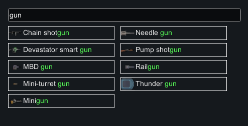
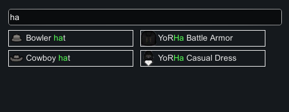
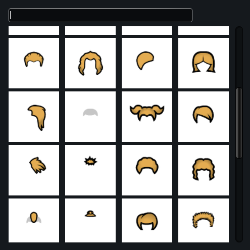
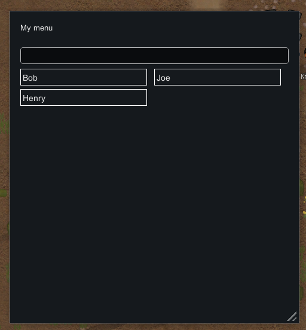

### BetterFloatMenu - An alternative to Rimworld's `FloatMenu` system.


<div>
    
    
    
<div>
    
## Why it exists
Rimworld has the `FloatMenu` utility, which is essentially a dropdown. It is used in both gameplay and menus. However, with many mods installed, these menus can become far too large and very difficult to read and navigate as a user. As a mod author, you may need large dropdown menus, but the FloatMenu just isn't good enough.
This BetterFloatMenu provides a very similar API as the regular FloatMenu, but offers a better UI, including a search bar.

## Installation
Open your mod project in Visual Studio or your IDE of choice.

Add the NuGet package to your `.cproj` or `PackageReference` file:
``` XML
<ItemGroup>
    <PackageReference Include="BetterFloatMenu" Version="*" />
</ItemGroup>
```

This will ensure that you always have the latest stable version.

Alternatively, you can simply copy the [BetterFloatMenu.cs file](BetterFloatMenu/BetterFloatMenu.cs) and put it in your project. This is not the preferred option, since you will not recieve improvements or bugfixes.

## Usage
Import the tool:
`import EpicUtils;`

Then you will need to have a list of items you want the user to pick from. These items can be anything you want: pawns, items, maps, colors, names etc.

In this example I will use strings for the sake of simplicity.

``` C#
// Your list of items. Can be any type.
var rawItems = new string[] { "Bob", "Joe", "Henry" };
```

You now need to turn these into MenuItems. `MenuItemBase` is an abstract class, and there are two default implementations provided by default:
`MenuItemText` and `MenuItemIcon`. `MenuItemText` will work for most use cases - but you can also create your own implementation of `MenuItemBase` for full control over rendering.

``` C#
// Turn raw items into MenuItemBases.
var items = new List<MenuItemBase>();
foreach(var raw in rawItems)
    items.Add(new MenuItemText(raw, raw));
    
// You can also use this utility method:
items = BetterFloatMenu.MakeItems(rawItems, raw => new MenuItemText(raw, raw));
```

Note that `MenuItemText`'s constructor has two mandatory arguments: the first is the payload (more on that later), and the second is a Label string.
Since our payload is already a string in this example, we simply pass `raw` in twice. If our payload were `float`s then we would do `new MenuItemText(raw, raw.ToString())`.

Finally, open the menu:
``` C#
var window = BetterFloatMenu.Open(items, item =>
{
    // Here item is the MenuItemBase. To extract the payload, call GetPayload, specifying the type of the payload.
    string selected = item.GetPayload<string>();
    
    // Do something with it!
    Log.Message($"The user clicked on: {selected}");
});

// You can also optionally customize the window here...
window.optionalTitle = "My menu";
window.resizeable = true;
window.CanSearch = true;
```


    
That is almost all there is to using this utility. There are quite a few customization options in the `BetterFloatMenu` class - please explore the API to understand them.
The code is well documented, and should be easy to understand.
